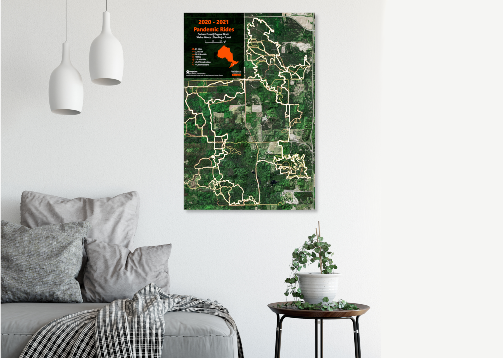
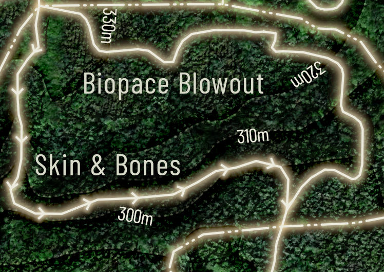
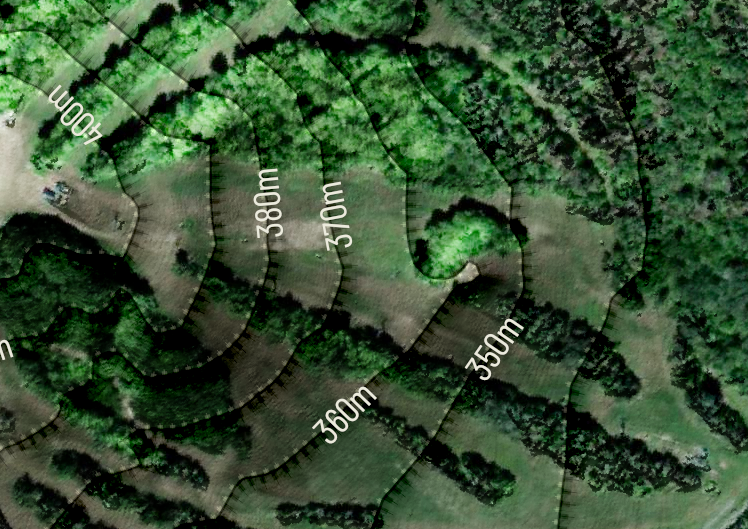
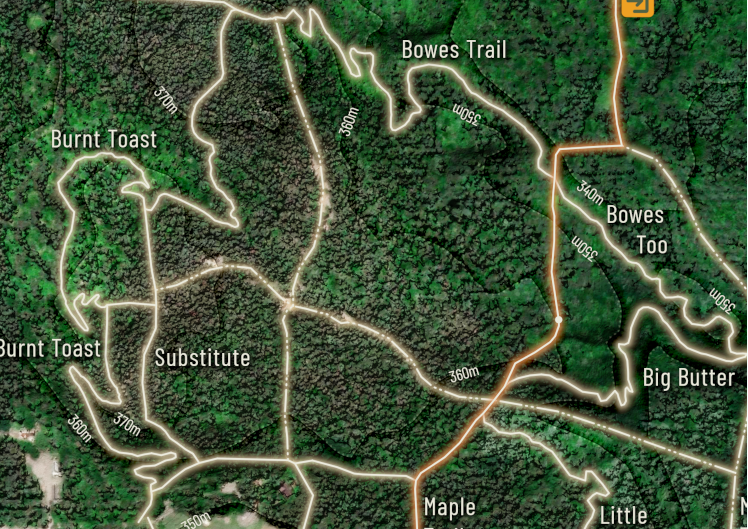
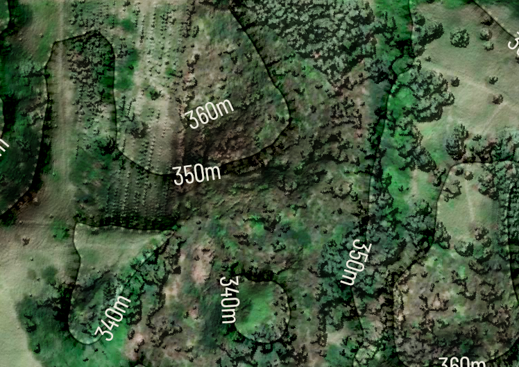
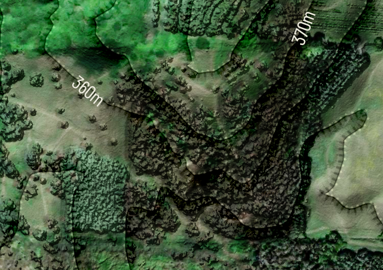
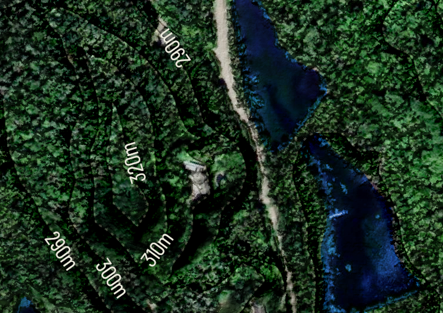
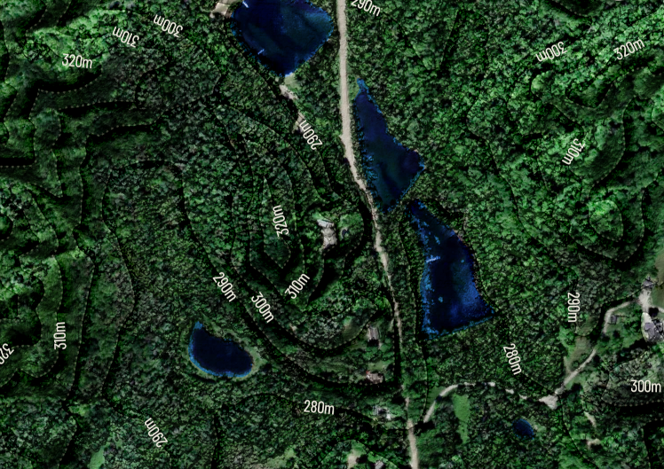
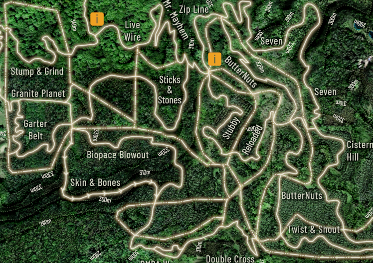
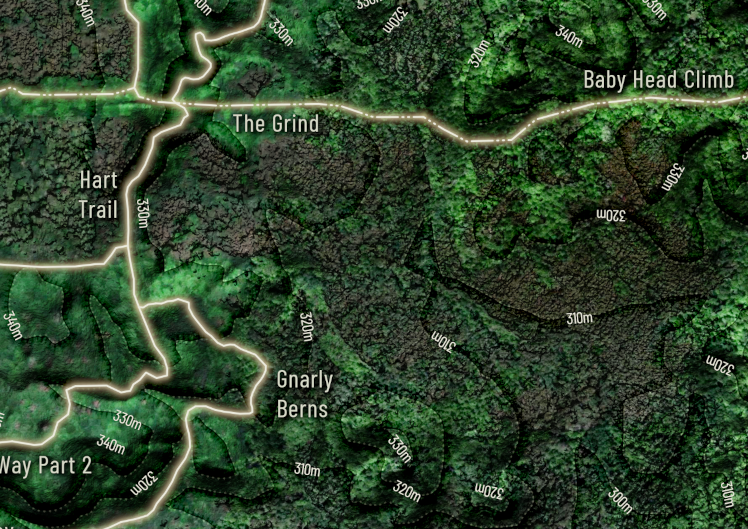

<html>
	<head>
		<title>Reach Above - Learn More</title>
		<meta charset="utf-8" />
		<meta name="viewport" content="width=device-width, initial-scale=1, user-scalable=no" />
		<link rel="stylesheet" href="assets/css/main.css" />
		<noscript><link rel="stylesheet" href="assets/css/noscript.css" /></noscript>
		<!-- Global site tag (gtag.js) - Google Analytics -->
		
			
	</head>
	<body class="is-preload">

		<!-- Page Wrapper -->
			

				<!-- Header -->
					<header id="header">
						<h1><a href="index.html">Reach Above</a></h1>
						<nav id="nav">
							<ul>
								<li class="special">
									<a href="#menu" class="menuToggle">Menu</a>
									

										<ul>
											<li><a href="index.html">Home</a></li>
											<li><a href="https://reachabove.ca/LearnMore">Learn More</a></li>
											<li><a href="https://reachabove.ca/FamilyRides">Biking</a></li>
										</ul>
									

								</li>
							</ul>
						</nav>
					</header>

				<!-- Main -->
					<article id="main">
						<header>
							<h2>More</h2>
							
Map Eye-Candy and How to grab Strava Data

						</header>
						<section class="wrapper style5">
							

								<h3>Personal Heat Maps</h3>
								
Want some motivation for the upcoming season? How about a custom map of the previous seasons sweat for your garage, pain-cave or office. Hanging it your house, canvas or framed in Black and White look top-notch. These maps are totally up to you. Pay tribute to a specific ride or experience or timeframe.

									

										

											

											

											

											

											

											

											

											

											

											

										

									

								
								<ul class="alt">
									<h5>How to get your Strava Data:</h5>
									<li>Log into the account on Strava.com from which you wish to bulk export data.</li>
									<li>Hover over your name in the upper right-hand corner of the Strava page. Choose "Settings, "then find the "My Account" tab from the menu listed on the Left.</li>
									<li>Select “Get Started” under “Download or Delete Your Account.”</li>
									<li>Select “Request your archive” on the next page.</li>
								</ul>
							<blockquote>You will receive an email with a link to download your data (this may take a few hours.) For this reason, it’s important that you have access to the email account attached to your Strava profile.</blockquote>
								
								

								<h4>Local Maps</h4>
								
Custom Local Maps are beautiful art and also have special meaning to the place you love. These can be any colour to match your home decor and come with a black or white frame. Maps include roads, rails, waterways, trails and buildings where possible. 

									

										

											

											
											

											

											
											

											

											

											

											

											

											
										

									

							

						</section>
					</article>

				<!-- Footer -->
						<footer id="footer">
						<ul class="icons">
							<li><a href="https://twitter.com/reach_above" class="icon brands fa-twitter">Twitter</a></li>
							<li><a href="https://www.instagram.com/reach.above/" class="icon brands fa-instagram">Instagram</a></li>
							<li><a href="https://reachabove.ca/" class="icon brands fa-dribbble">Dribbble</a></li>
							
						</ul>
						<ul class="copyright">
							<li>&copy;Reach Above 2023</li>
							<li><a href="https://www.openstreetmap.org/about/">&copy;OpenStreetMap contributors</a></li>
							<li><a href="https://www.mapbox.com/about/maps/">&copy;Mapbox</a></li>
							<li><a href="https://www.maxar.com/">&copy;Maxar</a></li>
							<li><a href="https://html5up.net">HTML5 UP</a></li>
						</ul>
					</footer>

			

		<!-- Scripts -->
			
			
			
			
			
			
			

	</body>
</html>
